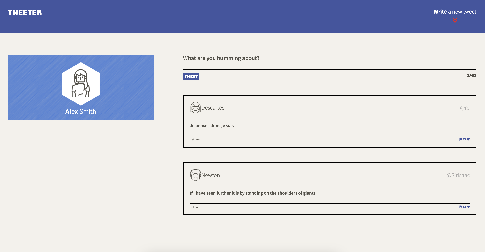
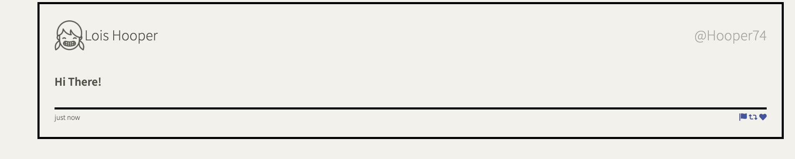

# Tweeter Project

Tweeter is a simple, single-page Twitter clone that allows users to post tweets and view a list of tweets. The app is built with HTML, CSS, JavaScript, jQuery, and AJAX for the front-end, and Node.js, Express, and MongoDB for the back-end.

---

## **Features**
- Responsive design that works seamlessly on mobile, tablet, and desktop devices.
- Compose new tweets with character validation and live character count updates.
- Real-time rendering of tweets without requiring a page refresh.
- Enhanced error handling for invalid tweet submissions.
- Dynamically styled tweets with a modern card design.
- Hover effects for interactive elements such as tweet icons (like, retweet, etc.).
- User-friendly UI with a clean and intuitive layout.

---

## **Updates Made**
### **UI/UX Improvements**
1. **Navigation Bar:**
   - Center-aligned Tweeter logo and "Write a new tweet" button.
   - Improved layout with consistent spacing and alignment.

2. **Header:**
   - Redesigned header with a profile card-style layout.
   - Rounded profile avatar for a modern look.

3. **Tweets:**
   - Card-style tweet layout with rounded corners and shadows.
   - Circular user icons for better aesthetics.
   - Enhanced typography for readability.
   - Added hover effects on interactive icons.

4. **Responsive Design:**
   - Mobile-first approach with media queries for tablet and desktop views.
   - Adjusted layout for consistent styling across all screen sizes.

---

## **Technologies Used**
- Front-End: HTML5, CSS3, JavaScript, jQuery, AJAX
- Back-End: Node.js, Express
- Database: MongoDB (optional for storing tweets)
- Dependencies:
  - `body-parser`
  - `express`
  - `chance`
  - `timeago.js`
  - `FontAwesome`

---

## **Getting Started**
### **Setup Instructions**
1. Clone the repository:
   ```bash
   git clone https://github.com/abbasbukhari/tweeter.git
   cd tweeter
## Screenshots

### Home Page


### Compose Tweet


### Mobile Version
